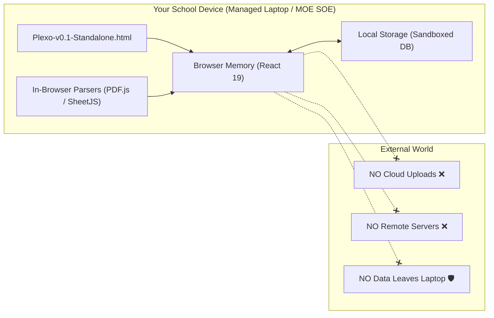
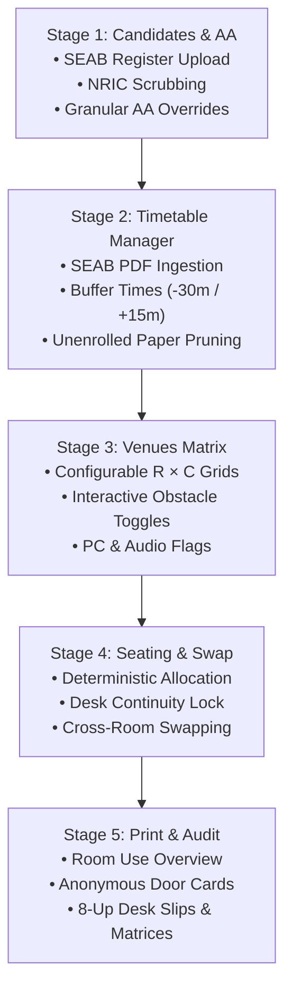

# Plexo 🎯

> **Client-Side Examination Seating & Logistics Platform for Singapore Schools**  
> Tailored for SEAB National Examinations (GCE N/O/A-Levels) & Internal School Assessments.

[](https://react.dev/)
[](https://www.typescriptlang.org/)
[](https://vite.dev/)
[](https://tailwindcss.com/)
[](./PRD.md)
[](./docs/USER_GUIDE.md)


---

## 📖 Table of Contents

- [Overview](#-overview)
- [The Problem & The Plexo Solution](#-the-problem--the-plexo-solution)
- [100% Local & PDPA Zero Data Egress](#-100-local--pdpa-zero-data-egress)
- [Five-Stage Operational Pipeline](#-five-stage-operational-pipeline)
  - [Stage 1: Candidate Directory & Access Arrangements (AA)](#stage-1-candidate-directory--access-arrangements-aa)
  - [Stage 2: Examination Timetable & Day Management](#stage-2-examination-timetable--day-management)
  - [Stage 3: Examination Venues Matrix](#stage-3-examination-venues-matrix)
  - [Stage 4: Seating Generation & Seat Swapping](#stage-4-seating-generation--seat-swapping)
  - [Stage 5: Official SEAB-Compliant Print & Audit Reports](#stage-5-official-seab-compliant-print--audit-reports)
- [Visual Tour & Screenshots](#-visual-tour--screenshots)
- [Quick Start: Running Plexo](#-quick-start-running-plexo)
  - [Option 1: Zero-Install Standalone HTML (Recommended for Schools)](#option-1-zero-install-standalone-html-recommended-for-schools)
  - [Option 2: Developer Setup (Local Source)](#option-2-developer-setup-local-source)
- [Repository Structure](#-repository-structure)
- [Technology Stack](#-technology-stack)
- [Documentation & Resources](#-documentation--resources)


---

## 🌟 Overview

**Plexo** is a specialized, zero-backend examination planning, seating allocation, and audit platform engineered specifically for the operational demands of Singapore primary and secondary schools administering **SEAB National Examinations** (GCE N(T), N(A), O-Level, and A-Level) as well as internal school preliminary examinations.

It automates candidate register ingestion, timetable scheduling, room layout customization, access arrangement (AA) segregation, consecutive paper desk-locking, and printable compliance documentation—all inside the browser sandbox with **zero data egress**.

---

## ⚡ The Problem & The Plexo Solution

Managing school-wide national examinations presents acute administrative challenges:

| Examination Challenge | Legacy Manual Approach | The Plexo Automated Solution |
| :--- | :--- | :--- |
| **Consecutive Paper Chaos** | Students wander halls during 45-min recesses between English P1 and P2 looking for new desks. | **Venue & Desk Continuity Lock:** Candidates sitting back-to-back papers automatically retain their exact desks. |
| **Complex Access Arrangements** | Vulnerable Excel formulas miss extra time or quiet room segregation rules. | **Granular Paper-Level AA Engine:** Default cohort settings with per-subject overrides (+15%, +25%, +50%, quiet rooms). |
| **Listening Comprehension (LC)** | AA students mistakenly isolated in rooms lacking calibrated audio playback. | **Acoustic Rule Enforcement:** AA candidates rejoin the cohort in the main hall with priority Row 1 acoustic placement. |
| **Lab & Computer Capacities** | Manual shift split tracking and holding room assignments lead to timetable clashes. | **Shift Splitting & Holding Rooms:** Automatic Shift 1 / Shift 2 splits with quarantine holding room management. |
| **Data Privacy & PDPA Risks** | Spreadsheets with NRIC numbers sent across shared network drives. | **Instant NRIC/FIN Sanitization:** NRICs are parsed and immediately purged; candidates are indexed purely by 4-digit Index Number. |
| **Administrative Fatigue** | Dozens of hours spent hand-formatting door cards, desk slips, and attendance sheets. | **1-Click SEAB Compliance Printing:** Generates 8-up desk slips, anonymous door cards, and daily room overview grids. |

---

## 🛡️ 100% Local & PDPA Zero Data Egress

Examination operations handle sensitive student personal information, academic histories, and confidential medical/psychological accommodation records. Plexo runs **entirely client-side** in your web browser:



- **Zero Cloud Transmission:** No data, files, or telemetry are ever transmitted to any remote server or cloud database.
- **Immediate NRIC/FIN Scrubbing:** National identification numbers (NRIC/FIN) are parsed solely to verify record uniqueness and are **immediately stripped from memory**. Candidates are identified only by their statutory 4-digit Index Number (e.g., `0005`).
- **MOE SOE Compatible:** Works directly on standard school laptops by double-clicking `Plexo-v0.1-Standalone.html`. No administrator privileges, Node.js runtime, or Python environment required.

---

## 🚀 Five-Stage Operational Pipeline



### Stage 1: Candidate Directory & Access Arrangements (AA)
- **Multi-File Aggregator:** Concurrently upload single or multiple `.xlsx` or `.csv` files (e.g. stream-by-stream files: Express, Normal Academic, Normal Technical). Records are merged by 4-digit Index Number without duplication.
- **SEAB Register Auto-Detection:** Automatically maps standard SEAB export headers (`Academic Level`, `Statutory Name`, `Index No.`, `Subject Code`, `Paper No`, `Mode of Assessment`).
- **Granular Paper-Level AA Overrides:** Assign accommodations cohort-wide (default) or customize per registered paper (e.g., +25% Extra Time for English Paper 1, but standard seating for Mathematics).

### Stage 2: Examination Timetable & Day Management
- **Timetable Ingestion:** Parses official SEAB timetable PDFs or spreadsheets with automated extraction of examination dates, paper codes, titles, start times, and durations.
- **Operational Buffers:** Calculates candidate reporting times (`startTime - 30 mins`) and dismissal/release windows (`endTime + 15 mins`).
- **One-Click Paper Pruning:** Automatically strips national timetable subjects with zero candidate enrollments in your school.
- **Bulk Date Management:** Clean date cards with quick-delete drawers to purge non-exam days.

### Stage 3: Examination Venues Matrix
- **Custom $R \times C$ Grids:** Define exact dimensions for School Halls, Classrooms, Science Laboratories, Computer Labs, or Quiet Rooms.
- **Interactive Obstacle Matrix:** Click any individual desk to mark it inactive (representing pillars, aisles, structural walkways, or broken desks).
- **Specialized Venue Capabilities:** Tag venues with PC workstation counts, acoustic/PA systems, science lab apparatus, and AA designation.

### Stage 4: Seating Generation & Seat Swapping
- **Deterministic Multi-Constraint Solver:**
  - **Back-to-Back Continuity:** Candidates retain the exact same seat across short intervals ($\le 45$–$60$ min) on the same day.
  - **Listening Comprehension Rule:** AA candidates rejoin their class cohort with preferential Row 1 acoustic seating.
  - **Science Practical Shifts:** Automatically splits cohorts exceeding lab capacity into Shift 1 / Shift 2 and routes the waiting shift to a designated quarantine holding room.
  - **Serpentine Fill:** Traverses columns in alternating directions to minimize line-of-sight copying.
- **Interactive 2D Floor Plan Visualizer:** Visualizes rooms oriented toward the Teacher's Stage.
- **Intra-Room & Cross-Room Swapping:** Swap any two candidates within a room or across different venues, or move candidates to empty standby rooms.

### Stage 5: Official SEAB-Compliant Print & Audit Reports
1. **Room Use Overview (Matrix):** Consolidated 5-minute granular horizontal timeline schedule showing room allocations, student counts, and daily throughput with one-click Excel export.
2. **Candidate Door Notice Cards:** Posted on room entrance doors; **strictly displays 4-digit Index Numbers only** (student names suppressed for PDPA privacy).
3. **Candidate Desk Slips (8-Up A4):** Pre-formatted grid with cutting lines, candidate names, index numbers, desk labels, and AA badges.
4. **Invigilator Attendance & Script Verification Matrix:** Printable 2D desk roster with verification checkboxes (`[ ] Absent`, `[ ] Script Collected`) and Chief Invigilator tally footers.
5. **Candidate Entry Proof & Timetable Slips:** Official individual student entry proof & examination timetable slips with registered papers, venues, and seats (1-Up or 2-Up paper saver).
6. **Exam Packing Cover Page (2-Page per Venue):** Dedicated packing envelope cover separated by venue:
   - **Page 1:** Examination paper particulars, candidate reporting/dismissal timings, candidate totals, class distribution, access arrangement summary, and official SEAB packing checklist & script reconciliation sign-offs.
   - **Page 2:** Official examination title header, Teacher's Bench indicator, and complete 2D seating plan floor layout showing desk labels, student index numbers, classes, names, and AA flags.

---

## 📸 Visual Tour & Screenshots

| Stage | Interface Preview |
| :--- | :--- |
| **Navigation & Header** |  |
| **Stage 1: Ingestion Banner** |  |
| **Stage 1: Candidate Roster** |  |
| **Stage 1: Granular AA Modal** |  |
| **Stage 2: Timetable Calendar** |  |
| **Stage 3: Venues Matrix** |  |
| **Stage 4: Seating Floorplan** |  |
| **Stage 4: Seat Swap Toolbar** |  |
| **Stage 5: Room Use Overview** |  |
| **Stage 5: Anonymous Door Card** |  |
| **Stage 5: 8-Up Desk Slips** |  |

---

## 💻 Quick Start: Running Plexo

### Option 1: Zero-Install Standalone HTML (Recommended for Schools)

No technical installation or dependencies required:
1. Download or locate `Plexo-v0.2-Standalone.html` (or extract `plexo-v0.2.zip`).
2. **Double-click `Plexo-v0.2-Standalone.html`** in Microsoft Edge or Google Chrome.
3. The platform opens immediately as an offline local application (`file:///...`).

### Option 2: Developer Setup (Local Source)

To run the development server or build from source:

#### Prerequisites
- [Node.js](https://nodejs.org/) (version 18+ or 20+ recommended)
- `npm` (bundled with Node.js)

#### 1. Clone the repository
```bash
git clone https://github.com/String-dxd/plexo.git
cd plexo
```

#### 2. Install dependencies
```bash
npm install
```

#### 3. Start local development server
```bash
npm run dev
```
Visit `http://localhost:5173` in your browser.

#### 4. Build for production
```bash
npm run build
```

#### 5. Generate Standalone Single-File Bundle
```bash
npm run package
```
This compiles all TypeScript, React components, CSS, and libraries into a single, self-contained `dist/Plexo-v0.2-Standalone.html` file using `vite-plugin-singlefile`.

---

## 📁 Repository Structure

```
plexo/
├── .github/                       # CI/CD workflows and repository metadata
├── docs/                          # Documentation & visual assets
│   ├── images/                    # UI screenshots and visual references
│   └── USER_GUIDE.md              # Detailed operations manual
├── public/                        # Static assets & SVG icons
├── scripts/                       # Automation scripts (PDF generation, screenshots)
├── src/
│   ├── assets/                    # Project branding & illustrations
│   ├── components/                # Core Stage UI Components
│   │   ├── CandidateViewport.tsx  # Stage 1: Candidate roster & AA manager
│   │   ├── TimetableManager.tsx   # Stage 2: Timetable calendar & date pruner
│   │   ├── VenueManager.tsx       # Stage 3: R × C venue grid configurator
│   │   ├── AllocationViewer.tsx   # Stage 4: Floorplan visualizer & seat swap engine
│   │   └── ReportViewer.tsx       # Stage 5: SEAB audit & print reports
│   ├── services/                  # Business logic & computation
│   │   ├── allocationEngine.ts    # Deterministic multi-constraint seating solver
│   │   ├── candidateParser.ts     # In-browser Excel/CSV/PDF register parsers
│   │   ├── internalCandidateParser.ts # MOE Internal Marksheet RE_RES_090 parser
│   │   └── internalTimetableParser.ts # School EOY Timetable parser
│   ├── store/
│   │   └── useExamStore.ts        # Zustand reactive state & localStorage sync
│   ├── types/
│   │   └── index.ts               # Core domain TypeScript interfaces
│   ├── App.tsx                    # Root application component & stage router
│   ├── main.tsx                   # React 19 entrypoint
│   └── index.css                  # Tailwind CSS v4 styling & print directives
├── index.html                     # Vite entry HTML
├── package.json                   # Project metadata & npm scripts
├── Plexo-v0.2-Standalone.html     # Ready-to-run zero-install offline HTML (v0.2)
├── Plexo-v0.1-Standalone.html     # Prior release legacy build (v0.1)
├── Plexo-v0.1-User-Guide.pdf      # Printable operations guide
├── PRD.md                         # Full Product Requirements Document
├── README.md                      # Repository overview & setup guide
├── tsconfig.json                  # TypeScript compiler configuration
└── vite.config.ts                 # Vite bundler & singlefile configuration
```

---

## 🛠️ Technology Stack

| Layer | Technology | Purpose |
| :--- | :--- | :--- |
| **Frontend Framework** | [React 19](https://react.dev/) | Declarative UI and high-performance component rendering |
| **Language** | [TypeScript 6](https://www.typescriptlang.org/) | Strict type safety across candidate, venue, and seating data structures |
| **Build Tooling** | [Vite 8](https://vite.dev/) | Lightning-fast HMR and optimized production bundling |
| **Single-File Bundler** | `vite-plugin-singlefile` | Inlines all scripts, styles, and assets into one offline `.html` file |
| **Styling** | [Tailwind CSS v4](https://tailwindcss.com/) | Responsive styling, light neutral palette, and `@media print` layouts |
| **State Management** | [Zustand 5](https://zustand-demo.pmnd.rs/) | Lightweight reactive state synchronized with browser `localStorage` |
| **File Parsing** | `xlsx` (SheetJS) & `pdfjs-dist` | In-browser parsing of candidate spreadsheets and official SEAB timetable PDFs |
| **Iconography** | [Lucide React](https://lucide.dev/) | Clean, accessible iconography |

---

## 📚 Documentation & Resources

- 📘 **[Official User Guide & Operations Manual](./docs/USER_GUIDE.md):** Complete operational handbook covering step-by-step examination workflows.
- 📄 **[Product Requirements Document (PRD)](./PRD.md):** Architectural specifications, algorithmic constraints, and data schemas.
- 📑 **[Plexo User Guide (PDF)](./Plexo-v0.1-User-Guide.pdf):** Formatted, printable operations guide for school examination committees.

---

## 🔒 Security & Data Privacy

Plexo is intentionally architected to operate with **zero telemetry, zero cookies, and zero network calls**. All computational workloads—from candidate file ingestion to deterministic seating allocation and PDF rendering—are executed locally in the end-user's browser memory sandbox.

---


