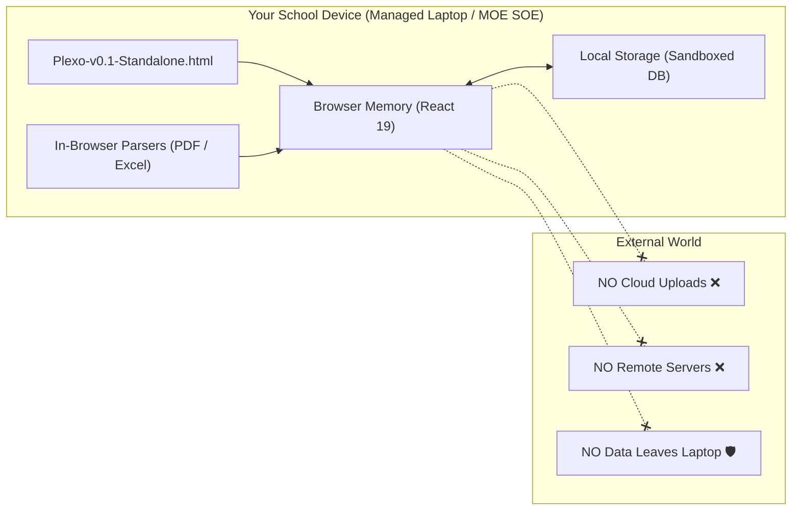
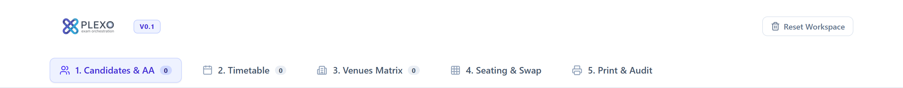
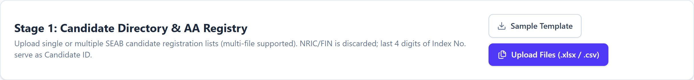
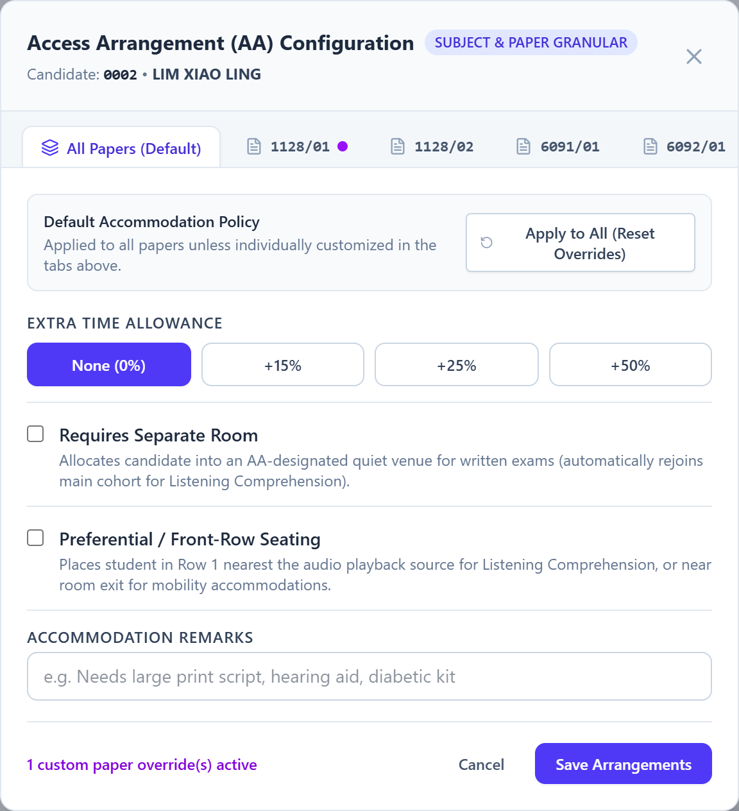
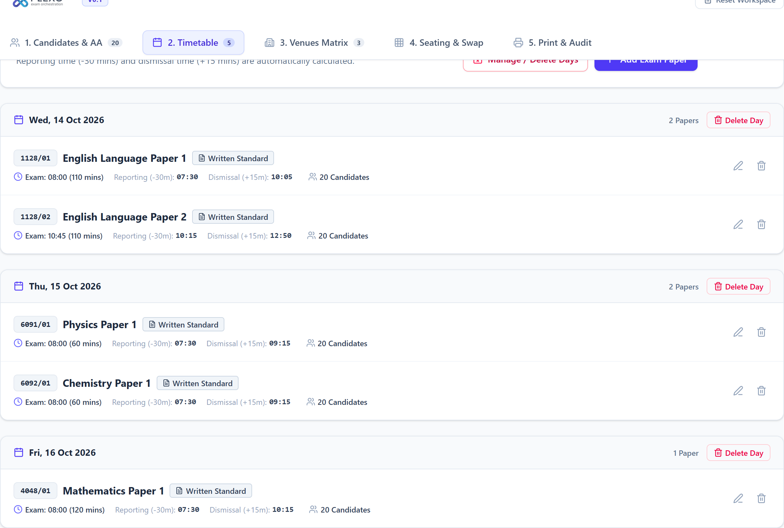
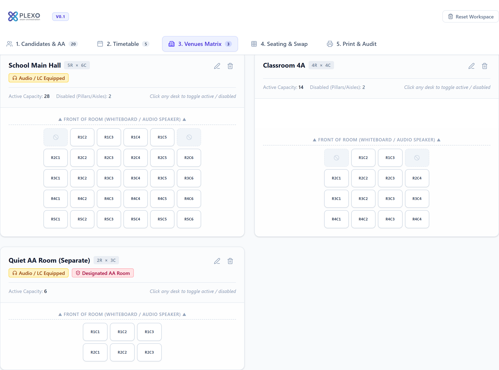
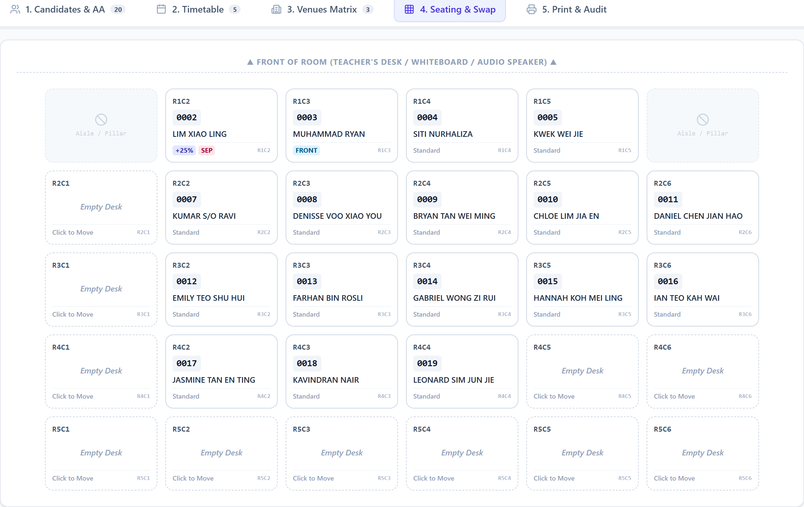
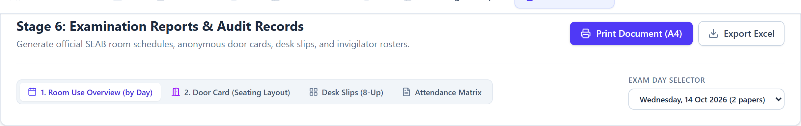
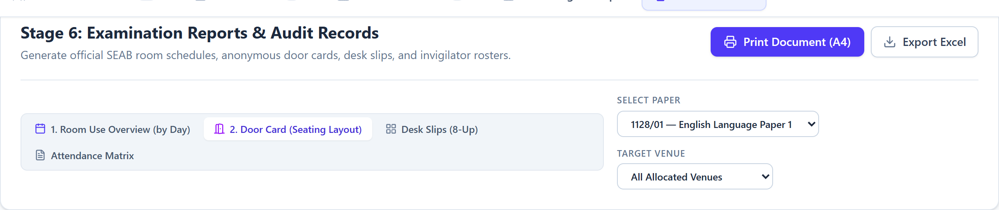
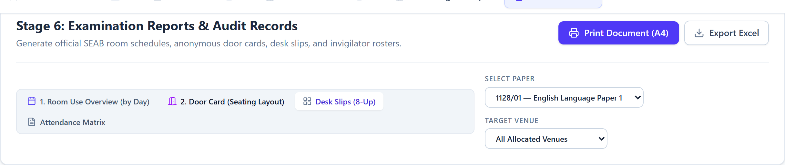

# Plexo: Singapore School Examination Seating Platform
## Official User Guide & Operations Manual (Version 0.1)

---

## 1. Product Purpose & The Local-Only Workflow Rationale

### 1.1 Purpose of the Product
**Plexo** is a specialized, zero-backend examination planning, seating optimization, and audit engine designed specifically for the operational realities of Singapore primary and secondary schools administering **SEAB National Examinations** (GCE N(T), N(A), O-Level, and A-Level) as well as internal school preliminary examinations.

School examination operations require complex logistics:
- **Consecutive Paper Continuity:** Candidates sitting for back-to-back papers (e.g., English Paper 1 followed by Paper 2 with a 45-minute recess) must retain their designated desks to eliminate hall confusion.
- **Granular Access Arrangements (AA):** Accommodating candidates requiring extra time (15%, 25%, 50%), quiet segregated rooms, or preferential front-row seating for Listening Comprehension—often varying on a paper-by-paper basis.
- **Multi-Shift Laboratory & PC Allocations:** Science practicals (Physics, Chemistry, Biology) and Computing examinations with shift rotations and holding rooms.
- **Audit & Compliance Documentation:** Generating SEAB-compliant door noticeboard cards, 8-up candidate desk slips, daily room schedule matrices, and invigilator attendance rosters.

Plexo replaces vulnerable, manual Excel spreadsheets with an automated, deterministic solver that completes whole-cohort seating allocations in seconds.

---

### 1.2 The Critical Importance of a 100% Fully Local Workflow
Examination management involves sensitive student demographic, academic, and medical data. Plexo is intentionally engineered with a **zero-backend, client-side-only architecture** to uphold the highest data governance standards:

> [!IMPORTANT]
> **Data Privacy & PDPA Compliance (Zero Data Egress):**
> * **Zero Remote Transmission:** All file parsing, algorithmic seat solving, 2D floorplan rendering, and PDF report generation occur **100% inside your browser's local sandbox**.
> * **Immediate NRIC/FIN Sanitization:** Upon file upload, national identification numbers (NRIC/FIN) are parsed strictly to verify uniqueness and **immediately discarded from memory**. Candidates are tracked purely by their statutory 4-digit Index Number (e.g., `0005`).
> * **Confidential AA Protection:** Medical, psychological, and mobility accommodation records remain strictly on the physical laptop running the session.
> * **Managed School Laptops (MOE SOE):** Works directly by double-clicking `Plexo-v0.1-Standalone.html`. Requires **no admin rights**, **no server installation**, **no Node.js**, and **no Python**.

---

## 2. Required Input Files

To configure your school's examination session, prepare the following two official files:

| File Type | Accepted File Formats | Source / Description | Key Data Extracted |
| :--- | :--- | :--- | :--- |
| **1. Official SEAB Candidate List** | `.xlsx`, `.xls`, `.csv` | Exported directly from the school administration cockpit or SEAB registration portal. Multi-file upload is supported. | • Academic Level • Statutory Full Name • 4-Digit Index Number • Enrolled Subject / Paper Codes (e.g., `1128/01`, `6091/01`) |
| **2. Official SEAB Exam Timetable** | `.pdf`, `.xlsx`, `.xls`, `.csv` | The official PDF calendar published by SEAB (e.g., GCE O-Level Timetable) or school internal spreadsheet. | • Examination Date (`YYYY-MM-DD`) • Start Time (`HH:mm`) • Duration (minutes) • Paper Title & Type (`WRITTEN`, `SCIENCE_LAB`, `LISTENING_COMP`) |

> [!TIP]
> **Multi-File Upload:** You can drag-and-drop multiple candidate files simultaneously (e.g., class-by-class spreadsheets: `4E1.csv`, `4E2.csv`, `4N1.csv`). Plexo automatically merges enrollments and indexes candidates by index number with zero duplication.

---

## 3. Step-by-Step User Guide

---

### Step 0: Launching Plexo on a Managed Laptop
1. Open your File Explorer.
2. Locate `Plexo-v0.1-Standalone.html` (or extract `plexo-v0.1.zip`).
3. **Double-click `Plexo-v0.1-Standalone.html`**. It opens directly in Microsoft Edge or Google Chrome under `file:///...`.
4. Observe the primary navigation bar across the top displaying the 5 sequential operational stages:

---

### Step 1: Stage 1 — Candidate Directory & Access Arrangements (AA)

#### 1.1 Ingesting Candidate Data
* Click **Stage 1: Candidates & AA**.
* Click **"Upload Files (.xlsx / .csv)"** or drag your registration files directly onto the ingestion zone.
* You may also click **"Sample Template"** to download an authentic SEAB-formatted reference CSV.

#### 1.2 Inspecting the Candidate Roster
Once uploaded, Plexo calculates summary tallies across the cohort (Standard Seating, Total AA Flagged, Extra Time, Separate Room, and Front Row Preferential Seating).
* Candidates are ordered by their 4-digit Index Number.
* Enrolled subject codes are listed as clickable badges.
* Any active Access Arrangements are displayed as color-coded tags.

#### 1.3 Configuring Granular Paper-Level Access Arrangements (AA)
Examinations often require accommodations that differ by subject (e.g., +25% extra time for English Writing, but standard conditions for Mathematics).
1. Click **"+ Add AA"** or **"Edit AA"** on any candidate row.
2. **"All Papers (Default)" Tab:** Sets baseline accommodations (+15%, +25%, +50%, Separate Room, Preferential Front Row, and Clinical Remarks).
3. **Individual Paper Tabs (e.g., `1128/01`):** Click any registered paper tab to customize accommodations exclusively for that paper.
4. Click **"Save Arrangements"**. Overridden papers display a purple badge on the candidate row.

---

### Step 2: Stage 2 — Examination Timetable & Day Management

#### 2.1 Timetable Ingestion
* Switch to **Stage 2: Timetable**.
* Drag and drop the **official SEAB Timetable PDF** (e.g., `2026_O_Level_Timetable.pdf`) or spreadsheet.
* Plexo automatically parses dates, paper titles, start times, and durations.

#### 2.2 Pruning & Day Management
National timetable PDFs often list 200+ subjects nationwide. To keep your schedule clean:
* **Prune 0-Candidate Papers:** Click **"Prune Unenrolled Papers"** to instantly remove papers where your school has zero registered candidates.
* **Delete Specific Days:** Click **"Delete Day"** on any calendar card, or use the **"Manage / Delete Days"** drawer to multi-select and purge irrelevant dates in one click.

---

### Step 3: Stage 3 — Examination Venues Matrix

#### 3.1 Batch Template Upload & Management
* Switch to **Stage 3: Venues Matrix**.
* **Download Sample Template:** Click **"Sample Template"** to download pre-configured `.csv` or `.xlsx` templates containing standard Singapore school exam rooms (School Hall, Classrooms, Computer Labs with PC station limits, Science Practical Labs, and AA Quiet Rooms with pre-configured disabled pillar/aisle desks).
* **Batch Upload:** Click **"Upload Template (.xlsx / .csv)"** to import one or multiple venue spreadsheets simultaneously. Plexo automatically parses dimensions, computer limits, capabilities, and disabled desks.
* **Export Venues:** Click **"Export"** to backup or roundtrip-edit configured rooms in CSV or Excel format.
* **Manual Add & Clone:** Click **"+ Add Venue"** for manual room creation, or click the **Clone** icon on any venue card to duplicate standard classroom grids in one click.

#### 3.2 Supported Template Columns
| Column Name | Required | Description | Example Values |
| :--- | :--- | :--- | :--- |
| **`Venue Name`** | Yes | Name of the exam hall or room | `School Hall`, `Classroom 4-1`, `Physics Lab 1` |
| **`Rows`** | Yes | Number of desk rows (front to back) | `12`, `6`, `8` |
| **`Columns`** | Yes | Number of desk columns (left to right) | `10`, `5`, `4` |
| **`Computer Lab`** | Optional | Indicates PC lab capability | `Yes`, `No` |
| **`Computer Stations`** | Optional | Number of usable PC workstations | `30`, `40` |
| **`Science Lab`** | Optional | Equipped for science practical shifts | `Yes`, `No` |
| **`Audio / LC Equipped`** | Optional | Suitable for Listening Comprehension audio broadcast (default: Yes) | `Yes`, `No` |
| **`AA Designated`** | Optional | Designated quiet room for Access Arrangements | `Yes`, `No` |
| **`Disabled Desks`** | Optional | Comma-separated list of disabled desks, pillars, or aisles | `"R1C1, R1C10, R12C1, R12C10"`, `"R1C3..R6C3"` |

#### 3.3 Interactive Desk Grid Customization
Every examination room has physical obstacles (pillars, aisles, unusable desks, invigilator pathways).
* Click any desk cell (`R1C1`, `R1C2`, etc.) to **toggle its active status**.
* Deactivated desks turn grey with a `Ban` icon (`Aisle / Pillar`) and are automatically skipped by the seating allocation engine.

---

### Step 4: Stage 4 — Seating Generation & Seat Swapping

#### 4.1 Automated Deterministic Allocation ("Batch Run All")
* Switch to **Stage 4: Seating & Swap**.
* To allocate a single paper, select it from the dropdown and click **"Generate Allocation"**.
* To allocate the entire exam session at once, click **"Batch Run All"**:
  * Runs chronological allocation enforcing **desk continuity** for back-to-back papers.
  * Respects Separate Room segregation and Front-Row Listening Comprehension seating.
  * Displays a cohort summary modal with seated candidate tallies and room notices.

#### 4.2 Interactive 2D Seating Floor Plan
* Visualizes the room layout mirroring the physical hall, with a top banner indicating the **Teacher's Desk / Stage (Front of Room)**.
* Desks display the Candidate Index Number, Name, Desk Label, Shift index, and AA tags.

#### 4.3 Cross-Room Swapping & Moving to Empty Standby Rooms
* **Swapping Seats Within the Same Room:** Click candidate A, then click candidate B $\to$ seats swap immediately.
* **Cross-Room Swapping:** Click candidate A in Venue 1 $\to$ switch room tabs to Venue 2 $\to$ click candidate B $\to$ candidates swap across venues with real-time toast confirmation.
* **Moving to an Empty Standby Room:** Click candidate A $\to$ click **"+ Show Empty Rooms"** $\to$ select the empty venue tab $\to$ click any empty desk to relocate. Alternatively, select the room directly from the **"Quick Move: Choose target room..."** dropdown.

---

### Step 5: Stage 5 — Print & Audit (SEAB Official Reports)

Switch to **Stage 5: Print & Audit** to access 4 purpose-built audit and operational documents:

#### 5.1 Report 1: Room Use Overview (by Day)
* **Horizontal Axis (Time of Day):** Papers starting at the same time slot (e.g., `08:00`) are consolidated into unified time columns with the full time window (e.g., `08:00 – 10:00`).
* **Vertical Axis (Venues):** Lists all rooms with room capacities.
* **Matrix Cells:** Displays paper code, paper title, and candidature count in that room for that time slot.
* **Summary Totals:** Shows slot totals and daily room throughput.
* **Excel Export:** Click **"Export Excel"** for an official scheduling matrix spreadsheet.

#### 5.2 Report 2: Candidate Door Notice Card (Anonymous Physical Seating)
* Posted on examination room entrance doors for student reference.
* **Strict Privacy Compliance:** Displays **ONLY Candidate 4-Digit Index Numbers** (`0001`, `0005`, etc.). Statutory student names are **strictly suppressed**.
* **Header Banner:** Features the prominent `▲ TEACHER'S BENCH (FRONT OF EXAMINATION ROOM) ▲` notice.
* **Multi-Room Page Breaks:** Selecting "All Allocated Venues" automatically formats clean page breaks (`A4`) between rooms for one-click batch printing.

#### 5.3 Report 3: Desk Slips (8-Up Grid on A4)
* Formatted with dashed cut lines for invigilators to place on desks prior to candidate entry.
* Includes Index Number, Candidate Full Name, Desk Label, Paper Code, and Access Arrangement Badges (e.g., `+25% EXTRA TIME`, `SEPARATE ROOM`).

#### 5.4 Report 4: Invigilator Attendance & Script Verification Matrix
* Complete candidate roster sorted by desk label.
* Features verification checkboxes for **Absent [ ]**, **Script Collected [ ]**, and candidate signature lines.
* Includes script tally summary footer with Chief Invigilator sign-off.

#### 5.5 Report 5: Candidate Entry Proof & Timetable Slips
* Official individual student entry proof cards displaying registered paper schedule, exam venues, assigned seats, and access arrangements.
* Supports **1 Student Per A4** and **2 Students Per A4 (Paper Saver)** layouts with scissors cutting guides.

#### 5.6 Report 6: Exam Packing Cover Page (2-Page per Venue)
* Designed specifically for subject departments packing question paper and script envelopes.
* Automatically separates data by examination venue:
  * **Page 1: Paper & Candidature Details:** Complete paper particulars, reporting/dismissal timings, candidate count, class distribution, access arrangement summary, seated candidate roster, and official SEAB packing checklist & script return reconciliation sign-offs.
  * **Page 2: Official Seating Plan:** Examination title header, Teacher's Bench indicator, and complete 2D seating plan floor layout showing desk labels, student index numbers, classes, names, and AA flags.
* Built-in Excel export generating a complete packing summary and venue candidate roster workbook.

---

## 4. Operational Checklist & Best Practices

1. **Before the Exam Season:**
   - [ ] Double-click `Plexo-v0.1-Standalone.html` to ensure Edge/Chrome launches cleanly.
   - [ ] Ingest candidate lists; verify AA counts match internal school Special Educational Needs (SEN) records.
   - [ ] Ingest timetable; click **"Prune Unenrolled Papers"** to clean national calendars.
   - [ ] Calibrate room seat grids in **Stage 3** to account for pillars, aisles, and AV speaker positions.
2. **Generating Seating:**
   - [ ] Click **"Batch Run All"** in **Stage 4** to execute deterministic allocation with venue continuity.
   - [ ] Inspect Separate Rooms to ensure AA students are segregated as required.
   - [ ] Use **Cross-Room Swap** or **Quick Move** for any ad-hoc administrative adjustments.
3. **Printing & Distribution:**
   - [ ] Export **Room Use Overview** to Excel for the Operations Head and Facilities team.
   - [ ] Print **Door Cards** (A4) to mount outside each exam room.
   - [ ] Print and slice **Desk Slips (8-Up)** for table placement.
   - [ ] Print **Invigilator Matrices** for chief invigilators and script tallying.
4. **Data Purge / Next Exam Cycle:**
   - [ ] Click **"Reset Workspace"** in the top right header to wipe all data from the browser sandbox when the examination season concludes.
